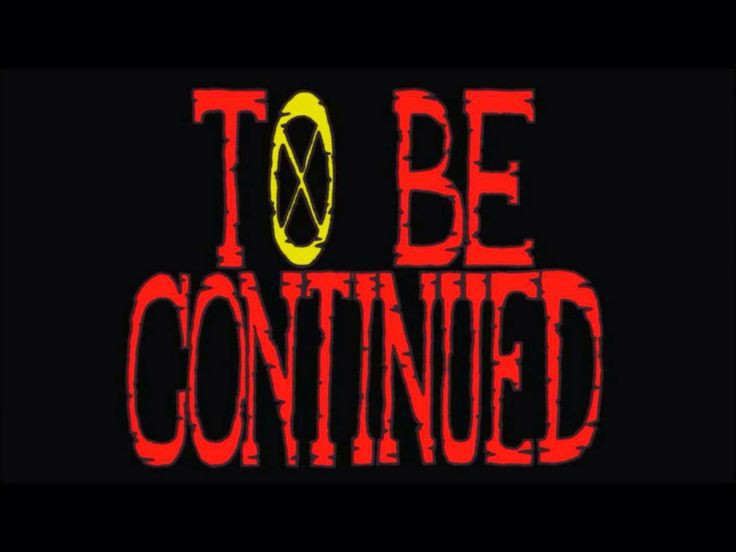
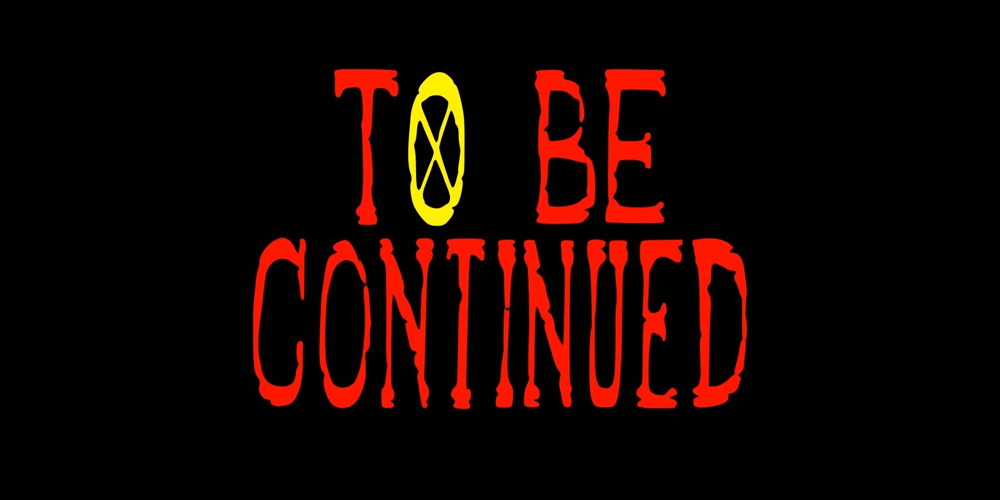

# ONE PIECE OUTRO USING MANIM - TO BE CONTINUED

This repository contains a custom font designed to replicate the iconic "To Be Continued" text style from One Piece. The font was created using **FontForge** and **Inkscape** and is tailored specifically for rendering the phrase **"TO BE CONTINUED"** with proper spacing and alignment.

## Original vs Custom Font Output

Here is a comparison between the original "To Be Continued" text style from One Piece and the output using the custom font you can download.

### Original:

### Custom Font Output:

## Font Details
- The font only includes the necessary letters required for the phrase "TO BE CONTINUED."
- The key mappings are customized due to repeating letters:
  - `T = T`
  - `O = O`
  - `B = B`
  - `E = E`
  - `C = C`
  - `O = o`
  - `N = N`
  - `T = t`
  - `I = I`
  - `N = n`
  - `U = U`
  - `E = e`
  - `D = D`
- The **spacebar** key is also customized within the font to ensure proper spacing in the phrase.

## Usage
1. Download and install the included `onepiece.ttf` font file.
2. Use it in any design or animation software to recreate the "To Be Continued" text.
3. Works seamlessly with **Manim** or any other rendering engine that supports custom fonts.

## Installation
To install the font on your system:
- **Windows**: Right-click the `.ttf` file and select **Install for all users**.
- **MacOS**: Double-click the `.ttf` file and click **Install Font**.
- **Linux/WSL**: Copy the `.ttf` file to `~/.fonts/` or `/usr/share/fonts/` and run `fc-cache -fv`.

## Licensing
This font is **free to use** without any license restrictions or permission requirements. Anyone can download, install, and use it as they wish.

## Contributions
Since this font is designed specifically for a **fixed phrase**, no further modifications are planned. However, if you wish to expand or improve it, feel free to fork the repository and customize it further.

Enjoy using the font!